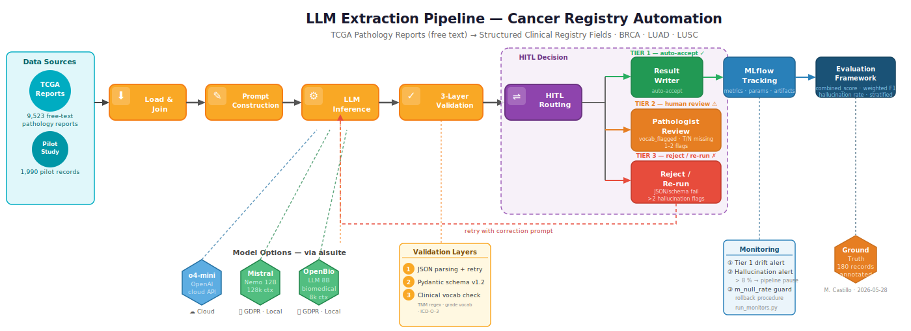

# Pathology Report LLM Extraction Pipeline

An end-to-end LLM pipeline that reads free-text oncology pathology reports and outputs structured clinical registry fields — enabling a Cancer Registry unit to replace manual extraction with an auditable, human-in-the-loop automated system.

Built on the public [TCGA pathology reports corpus](https://github.com/MGH-LCS/tcga-pathology-reports) (9,523 reports across 33 cancer types), piloted on breast (BRCA), lung adenocarcinoma (LUAD), and lung squamous cell carcinoma (LUSC).

---

## Pipeline Architecture



---

## What it does

Manual extraction of TNM staging, histological diagnosis, tumour grade, and other registry fields from free-text reports is inconsistent and unscalable (1–3 min/report). This pipeline:

1. **Loads** pathology reports from a JSONL corpus with cancer-type metadata
2. **Constructs versioned prompts** with few-shot examples and a JSON skeleton derived directly from the Pydantic schema (so structure can never drift)
3. **Calls any LLM** via a unified `provider:model` string — GPT-4o, o4-mini, Mistral, local Ollama models — one config value to swap
4. **Validates** output through three layers: JSON parsing → Pydantic schema → clinical vocabulary check (TNM regex, ICD-O-3 site list, grade controlled vocabulary)
5. **Evaluates** against a pathologist-annotated ground truth using field-level F1, completeness-aware semantic similarity (SapBERT embeddings), and a composite `combined_score`
6. **Tracks** every run in MLflow: model, prompt version, dataset version, metrics, cost, latency — making every result reproducible and comparable

---

## Extraction targets

| Group | Field | Difficulty |
|-------|-------|-----------|
| A — Patient ID | Sex | Low |
| B — Tumour | Primary tumor site | Low |
| B — Tumour | Specimen type | Low |
| B — Tumour | Histological diagnosis | Medium |
| B — Tumour | Histological subtype | Medium |
| B — Tumour | Tumor grade | Medium |
| B — Tumour | TNM stage — T | High |
| B — Tumour | TNM stage — N | High |
| B — Tumour | TNM stage — M | High |

---

## Evaluation approach

Success is measured by `combined_score` ≥ 0.85 on a 180-record pathologist-annotated evaluation set:

- **Free-text fields** (primary site, histology, grade, specimen type): completeness-aware semantic similarity via SapBERT — captures clinical equivalence (e.g. "invasive ductal carcinoma" ≈ "IDC") so pathologist review is only triggered when genuinely needed
- **Coded fields** (TNM T/N/M): exact-match F1 — staging codes require exact accuracy; partial credit is clinically misleading

Human-in-the-loop is a design requirement: a tiered HITL system flags records below per-field confidence thresholds for pathologist review rather than silently passing them.

---

## Stack

| Component | Technology |
|-----------|-----------|
| LLM interface | OpenAI SDK (supports OpenAI, Ollama, vLLM, LM Studio via base URL override) |
| Structured output | Pydantic v2 + OpenAI `response_format` |
| Experiment tracking | MLflow |
| Embeddings (eval) | SapBERT (`cambridgeltl/SapBERT-from-PubMedBERT-fulltext`) |
| Package manager | uv |
| Notebooks | Jupyter |
| Tests | pytest |

---

## Project structure

```
src/
  pipeline/         5-component extraction pipeline
    loader.py         report loading & corpus joins
    prompt_constructor.py  versioned prompt assembly, token counting
    model_caller.py   provider-agnostic LLM caller
    validator.py      3-layer validation (JSON → Pydantic → vocab)
    result_writer.py  JSONL output and run summary
    mlflow_tracker.py MLflow run lifecycle
  evaluation/       metric computation
    metrics.py        field-level F1, semantic similarity, combined_score
    semantic.py       SapBERT embedding cache and cosine similarity
    hitl_thresholds.py HITL tier classification
    model_comparison.py cross-run cost and accuracy comparison
  monitoring/       production monitoring hooks
    hallucination_alert.py
    pass_rate_monitor.py
    field_null_rate_monitor.py
    token_usage_monitor.py
  schema.py         Pydantic output schema (versioned)
  prompts/          versioned prompt templates (v1.0 → v1.9)

notebooks/
  01_eda.ipynb              corpus exploration, report style classification
  03_evaluation.ipynb       field-level accuracy, HITL tier distribution
  06_cross_run_comparison.ipynb  multi-model/prompt benchmarks
  07_embedding_comparison.ipynb  SapBERT vs. exact-match evaluation

tests/              unit + integration tests for all pipeline components
specs/
  mission.md        goals, extraction targets, success criteria
  tech-stack.md     architectural decisions and versioning policy
  roadmap.md        phase-by-phase development history
```

---

## Quickstart

```bash
# Install dependencies
uv sync

# Configure API keys
cp .env.template .env
# Edit .env with your OpenAI key (and optionally Ollama base URL)

# Run the pipeline on a JSONL corpus
uv run python src/pipeline/run_pipeline.py \
  --input data/processed/corpus.jsonl \
  --output data/processed/results.jsonl \
  --model openai:gpt-4o \
  --prompt-file src/prompts/extraction_v1.9.txt

# Run tests
uv run pytest tests/ -v

# Launch notebooks
uv run jupyter notebook
```

Swap `--model openai:gpt-4o` for `--model ollama:mistral` to run locally with no data leaving your machine.

---

## Versioning policy

Every change to a prompt template, Pydantic schema, or dataset increments the version (`v1.0` → `v1.1`). The version is logged in every output record and every MLflow run, so results are always traceable to the exact configuration that produced them.

---

## Data note

The TCGA corpus is a public research dataset (not real hospital data). In a production hospital context, local Ollama models or GDPR-compliant APIs would replace cloud providers. The `data/` directory is not committed; see [Kefeli et al., 2024](https://www.nature.com/articles/s41597-024-03443-1) for the source dataset.
